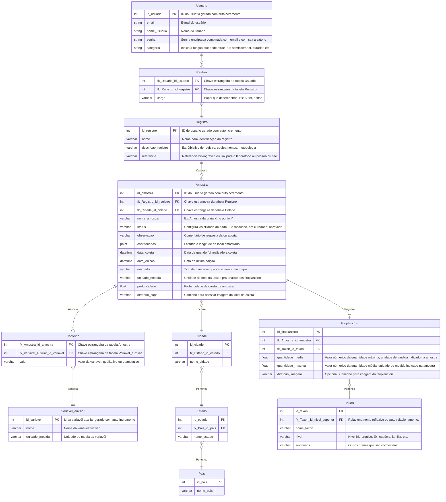

## Lógico

```mermaid
erDiagram
    Usuario {
        int id_usuario PK "ID do usuario gerado com autoincremento"
        string email "E-mail do usuário"
        string nome_usuario "Nome do usuário"
        string senha "Senha encriptada combinada com email e com salt aleatorio"
        string categoria "Indica a função que pode atuar. Ex: administrador, curador, etc"
    }

    Realiza {
        int fk_Usuario_id_usuario FK "Chave estrangeira da tabela Usuario"
        int fk_Registro_id_registro FK "Chave estrangeira da tabela Registro"
        varchar cargo "Papel que desempenha. Ex: Autor, editor"
    }

    Registro {
        int id_registro PK "ID do usuario gerado com autoincremento"
        varchar nome "Nome para identificação do registro"
        varchar descricao_registro "Ex: Objetivo do registro, equipamentos, metodologia"
        varchar referencia "Referência bibliográfica ou link para o laboratório ou pessoa ou site "
    }
    
    Usuario ||--o{ Realiza : ""
    Realiza }|--|| Registro : ""

    Registro ||--o{ Amostra : Cadastra

    Amostra {
        int id_amostra PK "ID do usuario gerado com autoincremento"
        int fk_Registro_id_registro FK "Chave estrangeira da tabela Registro"
        int fk_Cidade_id_cidade FK "Chave estrangeira da tabela Cidade"
        varchar nome_amostra "Ex: Amostra da praia X no ponto Y"
        varchar status "Configura visibilidade do dado. Ex: rascunho, em curadoria, aprovado."
        varchar observacao "Comentário de resposta da curadoria"
        point coordenadas "Latitude e longitude do local amostrado"
        datetime data_coleta "Data de quando foi realizado a coleta"
        datetime data_edicao "Data da última edição"
        varchar marcador "Tipo de marcador que vai aparecer no mapa"
        varchar unidade_medida "Unidade de medida usado pra analise dos fitoplancton"
        float profundidade "Profundidade da coleta da amostra"
        varchar diretorio_capa "Caminho para acessar imagem do local da coleta"
    }

    Amostra ||--o{ Contexto : Associa

    Contexto {
        int fk_Amostra_id_amostra FK "Chave estrangeira da tabela Amostra"
        int fk_Variavel_auxiliar_id_variavel FK "Chave estrangeira da tabela Variavel_auxiliar"
        varchar valor "Valor da variavel, qualitativo ou quantitativo"
    }

    Variavel_auxiliar {
        int id_variavel PK "Id da variavél auxiliar gerado com auto incremento"
        varchar nome "Nome da variavél auxiliar"
        varchar unidade_medida "Unidade de media da variavél"
    }

    Contexto }o--|| Variavel_auxiliar : Associa

    Amostra }o--|| Cidade : ocorre

    Cidade {
        int id_cidade PK
        int fk_Estado_id_estado FK
        varchar nome_cidade
    }

    Estado {
        int id_estado PK
        int fk_Pais_id_pais FK
        varchar nome_estado
    }

    Pais {
        int id_pais PK
        varchar nome_pais
    }
    
    Cidade }o--|| Estado : Pertence
    Estado }o--|| Pais : Pertence

    Fitoplancton {
        int id_fitoplancton PK
        int fk_Amostra_id_amostra FK
        int fk_Taxon_id_taxon FK
        float quantidade_media "Valor númerico da quantidade máxima, unidade de medida indicado na amostra"
        float quantidade_maxima "Valor númerico da quantidade média, unidade de medida indicado na amostra"
        varchar diretorio_imagem "Opcional. Caminho para imagem do fitoplancton"
    }

    Amostra ||--|{ Fitoplancton : Registra

    Taxon {
        int id_taxon PK
        int fk_Taxon_id_nivel_superior FK "Relacionamento reflexivo ou auto relacionamento."
        varchar nome_taxon
        varchar nivel "Nivél hierarquico. Ex: espécie, familia, etc."
        varchar sinonimos "Outros nomes que são conhecidos"
    }

    Fitoplancton }o--|| Taxon : Pertence
```